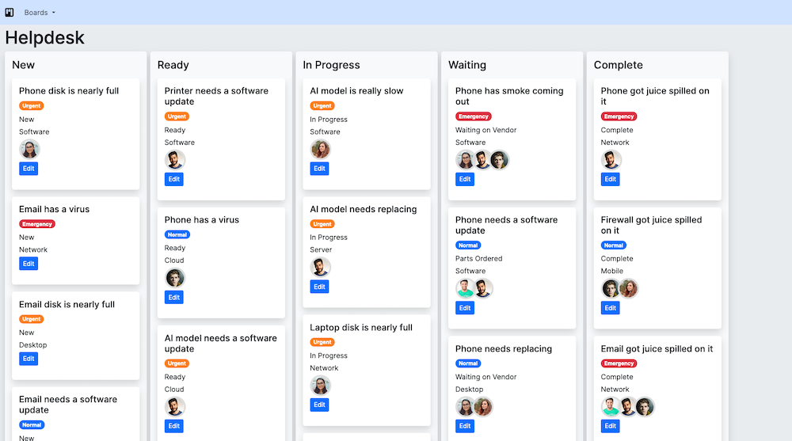

# web-dev-exercise

This is a foundation of a basic Django app that shows helpdesk tickets on a Kanban board.

## Setup

Clone the repo.

### Make a virtualenv

Linux:

```
python3 -m venv venv
```

macOS with Homebrew Python:

```
/opt/homebrew/bin/python3.12 -m venv venv
```

### Install libraries

```
source venv/bin/activate
pip install --upgrade pip
pip install --upgrade -r requirements.txt
```

If you use [Direnv](https://direnv.net/) or similar (and you should), make a `.envrc` file to automatically load the virtualenv when you arrive.

```
echo "source $(pwd)/venv/bin/activate" >> .envrc
```

There is no JavaScript install/build step for this app.

## Run the app

You should use the db.sqlite3 file included in the repo. No special steps are required to use it.

Go to the project directory.

```
cd kanban/
```

Make yourself a superuser for use on the admin site (/admin).

```
python manage.py createsuperuser
```

Run the app.
```
python manage.py runserver
```

When you browse to the local site at [http://127.0.0.1:8000/](http://127.0.0.1:8000/), and click one of the Kanban boards, you'll see something like this:



Run the tests.

```
python manage.py test
```

